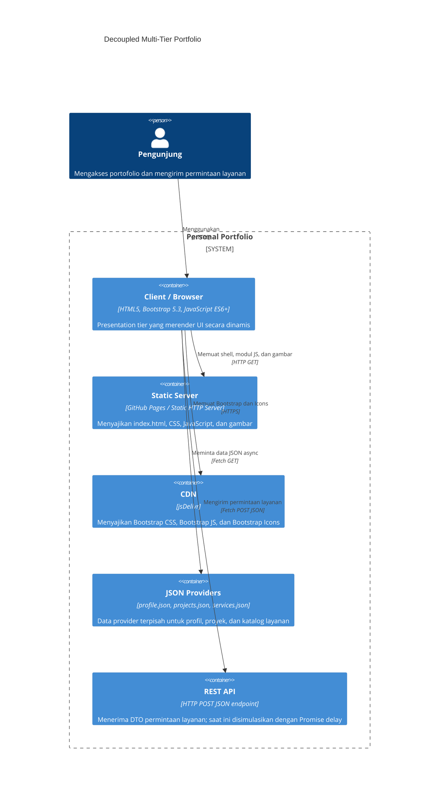

# Portofolio Web Week 4

Portofolio ini adalah transformasi tugas Week 3 untuk mata kuliah Pemrograman dan Pengujian Web (12S3101), Institut Teknologi Del. Implementasinya menggunakan Bootstrap 5.3, JavaScript ES6+, Fetch API, dan provider JSON yang dipisahkan dari shell HTML.

## Live Deployment

- GitHub Pages: [TODO: isi tautan live deployment GitHub Pages]
- Status deployment: belum diverifikasi

## Arsitektur C4 Container



### Separation of Concerns

- **Presentation tier:** `index.html`, `css/custom-style.css`, dan `js/app.js` mengelola struktur, gaya, state UI, event, validasi, dan rendering DOM.
- **Application/service logic tier:** `ApiService` di `js/api-service.js` menjadi batas akses data. Ia menangani Fetch GET untuk provider JSON dan menyediakan kontrak submit POST yang dapat diarahkan ke endpoint mock sungguhan.
- **Data storage tier:** `data/profile.json`, `data/projects.json`, dan `data/services.json` berperan sebagai data layer decoupled. Riwayat pesanan disimpan di `localStorage` browser.

Pemisahan ini membuat perubahan data tidak memerlukan perubahan shell HTML. Lapisan presentasi juga tidak perlu mengetahui detail URL atau mekanisme request karena seluruh akses dilakukan melalui `ApiService`.

## Perbandingan Arsitektur

| Arsitektur | Karakteristik | Kelebihan | Trade-off |
| --- | --- | --- | --- |
| Monolith | UI, aturan bisnis, dan data berada dalam satu aplikasi | Sederhana untuk dimulai dan dideploy | Perubahan satu bagian dapat memengaruhi seluruh aplikasi |
| Microservices | Fitur dipisah menjadi service yang berkomunikasi melalui API | Independen untuk dikembangkan dan diskalakan | Operasional, observability, dan komunikasi jaringan lebih kompleks |
| SSR | Server merakit HTML untuk setiap request | Konten awal dan SEO baik | Membutuhkan runtime server dan beban render di server |
| CSR | Browser merakit DOM dari data API | Interaksi setelah load terasa mulus dan API dapat dipakai ulang | Membutuhkan JavaScript; state loading dan error harus ditangani |
| Jamstack / decoupled static | Aset statis disajikan CDN dan data diakses melalui API | Hosting sederhana, caching efektif, dan boundary jelas | Integrasi data dinamis memerlukan API/serverless tambahan |

## Perbandingan Sebelum dan Sesudah Refactoring

| Area | Sebelum (Week 3) | Sesudah (Week 4) |
| --- | --- | --- |
| Sumber data | Kartu, modal, profil, dan layanan hardcoded di HTML | Data dipisahkan ke tiga provider JSON |
| Rendering proyek | Markup statis | CSR async dengan `fetch`, `async/await`, dan DOM API |
| UI state | Belum dikelola terpusat | Loading, success, empty, dan error dengan retry |
| Filter | Belum tersedia | Filter kategori instan dari `projects.json` |
| Modal | Empat modal proyek terpisah | Satu `#universalProjectModal` berdasarkan data ID |
| Form | Validasi inline dan submit standar | Validasi di `app.js`, DTO JSON, async dispatch, dan Toast |
| State pesanan | Tidak persisten | `localStorage` dengan badge jumlah pesanan reaktif |
| Keamanan | Belum ada CSP terarah | DOM API/textContent dan CSP tanpa `unsafe-inline` |

## Struktur Direktori

```text
.
├── index.html
├── css/custom-style.css
├── data/
│   ├── profile.json
│   ├── projects.json
│   └── services.json
├── js/
│   ├── api-service.js
│   └── app.js
├── assets/img/
└── README.md
```

Provider saat ini berisi 4 proyek dan 4 layanan. Semua data yang berasal dari provider dirender melalui `textContent`, atribut DOM, atau node DOM yang dibuat programmatically.

## Profil Kinerja DevTools

Pengukuran berikut harus diisi dari Chrome atau Edge DevTools pada tab Network dan Performance. Angka dan screenshot belum diisi karena tidak boleh direka.

| Skenario | TTFB | FCP | Cache / status | Catatan |
| --- | --- | --- | --- | --- |
| Cold load | TODO: isi dari pengukuran saya | TODO: isi dari pengukuran saya | TODO: isi dari pengukuran saya | TODO: isi dari pengukuran saya |
| Warm load | TODO: isi dari pengukuran saya | TODO: isi dari pengukuran saya | TODO: isi dari pengukuran saya | TODO: isi dari pengukuran saya |

### Analisis Waterfall

- Screenshot waterfall: TODO: lampirkan screenshot dari pengukuran saya
- Analisis request JSON dan asset: TODO: isi dari pengukuran saya
- Verifikasi `ETag` atau `304 Not Modified`: TODO: isi dari pengukuran saya
- Status pengukuran DevTools: belum diverifikasi

## Cara Menjalankan dan Menguji

1. Buka folder ini di VS Code.
2. Jalankan Live Server dari `index.html`. Fetch provider JSON tidak berjalan dengan benar melalui `file://`.
3. Pada browser, verifikasi spinner lalu kartu proyek dan coba filter kategori sampai muncul empty state.
4. Klik `Detail Proyek` untuk memverifikasi modal universal dan metrik proyek.
5. Isi form valid, kirim, lalu verifikasi Toast, reset form, dan kenaikan badge pesanan.
6. Buka DevTools Application untuk melihat `serviceOrders` di Local Storage.
7. Matikan atau ubah URL provider untuk memverifikasi error alert dan tombol coba lagi.

## Batasan dan Status Verifikasi

- Endpoint POST masih simulasi dengan Promise delay. Isi `ApiService.ORDER_ENDPOINT` untuk memakai mock REST endpoint sungguhan.
- Angka TTFB, FCP, cold/warm load, status 304, dan screenshot waterfall: belum diverifikasi.
- Deployment GitHub Pages: belum diverifikasi.
